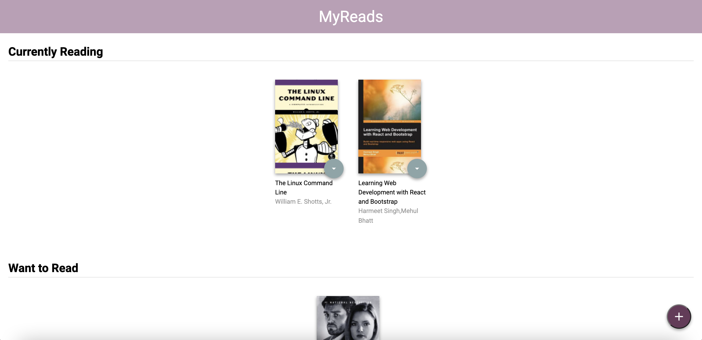
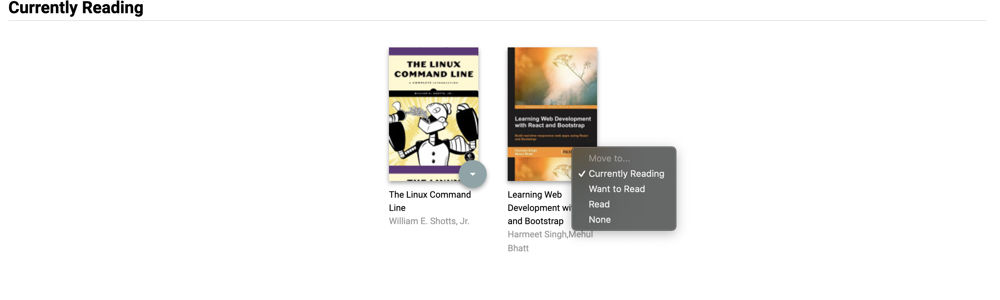
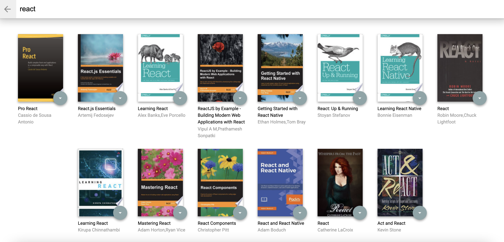

# MyReads Project

This repository contains my implementation of the MyReads app. This is the final assessment project for the Udacity's React Fundamentals course, part of the React Nanodegree Program. MyReads is a bookshelf app that allows the user to select and categorize books they have read, are currently reading, or want to read.

## Demo

## Getting Started

These instructions will get you a copy of the project up and running on your local machine for development and testing purposes.

Prerequisites
The project can be built with npm or yarn, so choose one of the approach bellow in case you don't have any installed on your system.

* npm is distributed with Node.js which means that when you download Node.js, you automatically get npm installed on your computer. Download Node.js.

or

* Yarn is a package manager built by Facebook Team and seems to be faster than npm in general. Download Yarn

## Installing

To download the project follow the instructions bellow

```git clone https://github.com/sarahalawfi/reactnd-project-myreads-starter.git
npm install
```
Once all of the dependencies have been installed you can launch the app with

```
npm start
```
A new browser window should automatically open displaying the app. If it doesn't, navigate to http://localhost:3000/ in your browser



## How to Use the App

* Books are sorted into three categories: Currently Reading, Want to Read and Read

* To change a book's category or remove a book from the list, click on the green button on the book cover



* To add new books, click on the purple + button at the bottom of the page. Enter an author's name or subject. Up to 20 items will be returned.

