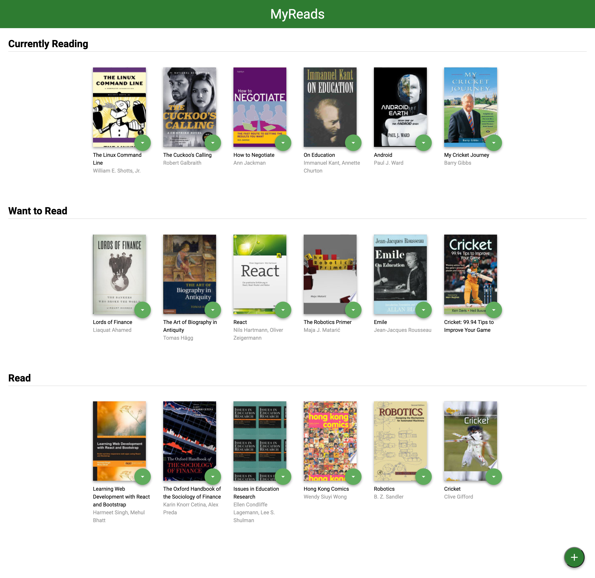
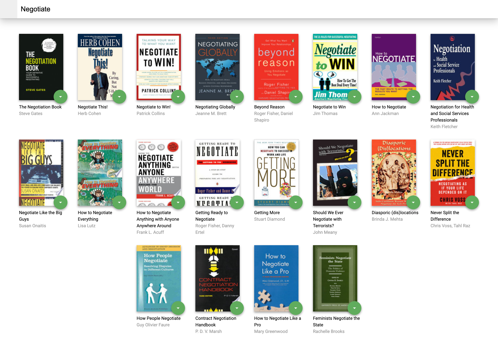

# MyReads Project

**This is my submission for** `MyReads: A Book Tracking App`

**In the MyReads project, I created a web application that allows you to select and categorize books you have read, are currently reading, or want to read.**

## Instructions to run app

To get started using this app right away:

* Install all project dependencies with `npm install`
* Start the server with `npm start`
* Visit http://localhost:3000/

## Application Screenshots

