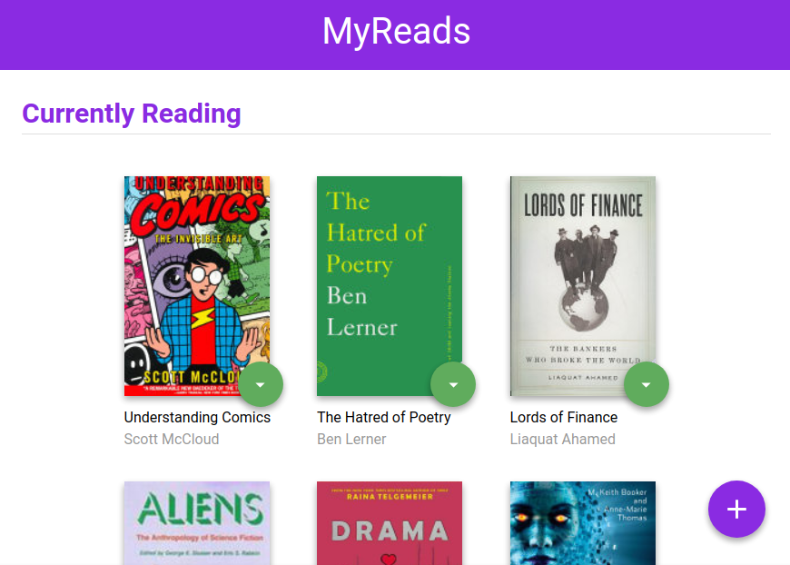
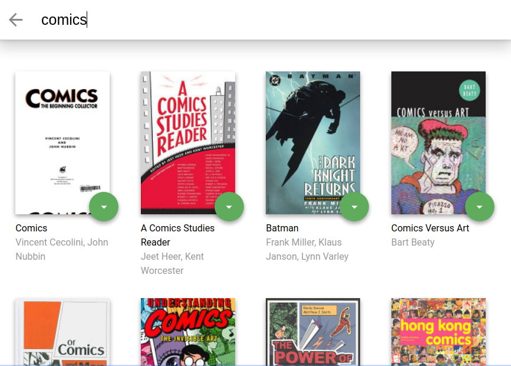

# MyReads: A Book Tracking Web App Built 
MyReads web app is created using React.js as a part of my Udacity's React Nanodegree program

## About
It is a single-page application i.e SPA  where by navigation happens without the need to refresh pages, and represents a virtual bookcase to store your books and track what you're reading.
MyReads lets you manage your digital bookshelf. It currently supports three shelves:
- Currently Reading
- Want to Read
- Read

You can also search and add books to any shelf of your choice. 

-------
## Development
A static example of the CSS and HTML markup was provided, and a backend API to communicate with a Backend Server from Udacity for book information and long term storage.
I then added interactivity to the app by refactoring the static code into react components, following DOT (Do One Thing) rule.

### Starter Code
[https://github.com/udacity/reactnd-project-myreads-starter](https://github.com/udacity/reactnd-project-myreads-starter)

### Backend Server

The provided file [`BooksAPI.js`](src/BooksAPI.js) contains following methods to perform necessary operations on the backend:

* `getAll` To get all the books from the API
* `update` Update shelf information of the book
* `search` Search book in the database

### Features I needed to add

In terms of UI
- The main page shows 3 shelves for books. Each book is shown on the correct shelf, along with its title and all of its authors.
- The search page has a search input field. As the user types into the search field, books that match the query are displayed on the page.
- The search works correctly when a book does not have a thumbnail or an author. (To test this, try searching for "poetry" and "biography").
- each book (in the main page, or in the results of a search) has a control that allows users to move it between shelves. The control is tied to each book instance.
- the shelf the book is in is reflected through its control on all pages
- any changes in book shelves should be reflected on all pages.
    ie. If a book's shelf is changed on the search page, then it should appear in the responding shelf on the main page.

In terms of state
- Component state is passed down from parent components to child components. The state variable is not modified directly - but by using setState() function.
- Books have the same state on both the search page and the main application page: If a book is on a bookshelf, that is reflected in both locations.

UI and URL are in sync
- Done using react-router

---------
## Screenshots

## Installation

Clone the repository, change directories, and use NPM to install the dependencies.
- Clone / Download this repo.
- Run `npm install` or `yarn install` in the project directory to install dependencies.

## Start
- The project can be run with `npm start`
- Then it can be viewed in the browser at [http://localhost:3000](http://localhost:3000)

## Important
The backend API is built by Udacity and **only a fixed set of search terms are supported.** Supported search terms can be found in [SEARCH_TERMS.md](SEARCH_TERMS.md). That list of terms are the _only_ terms that will work with the API.
